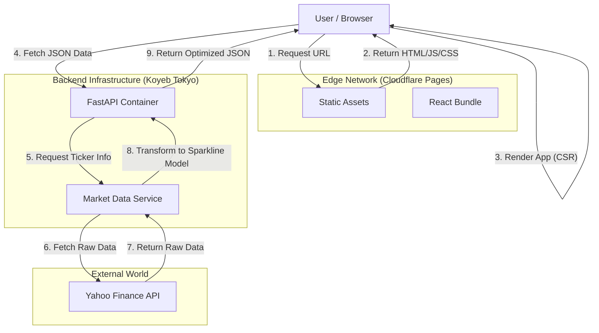

# System Architecture

## 1. High-Level Overview

Stogra utilizes a **Decoupled Client-Server Architecture**. The system is composed of a high-performance Single Page Application (SPA) serving as the presentation layer, and a containerized REST API serving as the data layer.

- **Frontend**: React application hosted on the **Cloudflare Global Edge Network**.
- **Backend**: Python (FastAPI) application containerized and running in **Koyeb's Tokyo Region**.
- **Data Source**: Real-time financial data aggregated from Yahoo Finance via the `yfinance` library.

## 2. Architecture Diagram



## 3. Core Components

### 3.1 The Client (Frontend)

- **Host**: Cloudflare Pages.
- **Rendering Strategy**: Client-Side Rendering (CSR).
- **Routing**: TanStack Router. Handles all navigation logic client-side, ensuring type-safe URL parameters and deep linking.
- **State Management**: TanStack Query. Manages server state (fetching, caching, synchronizing, and updating stock prices).
- **Persistence**: LocalStorage. Watchlists are serialized to JSON and stored in the browser's local storage.
- **Design System**: Atomic components built with React + Tailwind CSS 4.0 using the Tweakcn OKLCH color space.

### 3.2 The Server (Backend)

- **Host**: Koyeb (Standard Micro Instance).
- **Region**: Tokyo (NRT) - Chosen for optimal latency in the APAC region.
- **Runtime**: Python 3.11+ running inside a Docker container.
- **API Framework**: FastAPI.
- **Concurrency**: Utilizes Python `async/await` to handle multiple downstream requests to `yfinance` simultaneously without blocking the main thread.

## 4. Data Flow & Communication

### 4.1 Request Lifecycle

- **Initial Load**: The user requests `PROD_URL_FROM_KOYEB`. Cloudflare Pages instantly serves the static HTML shell and the JavaScript bundle.
- **Hydration**: React mounts. TanStack Router determines the active view (e.g., Homepage).
- **Skeleton UI**: Components display "Shimmer" skeletons (via Shadcn) while data is pending.
- **Data Fetch**: TanStack Query triggers an async GET request to the Koyeb endpoint (e.g., `/api/market/snapshot`).
- **Processing**: FastAPI receives the request, validates it via Pydantic, queries `yfinance`, formats the sparkline data, and returns the JSON.
- **Paint**: React receives the JSON and updates the UI with the live data.

### 4.2 Caching Strategy (Phase 1)

- **Browser Cache (HTTP)**: Static assets (JS/CSS) are cached aggressively by Cloudflare.
- **Application Cache (TanStack Query)**: Stock data is cached in-memory for 60 seconds (default `staleTime`). If a user navigates away and back within 60s, no network request is made.
- **Backend Cache**: None in Phase 1 (Direct pass-through).

## 5. Security & Constraints

- **CORS (Cross-Origin Resource Sharing)**: Since the Frontend (Cloudflare) and Backend (Koyeb) live on different domains, the FastAPI backend is configured to allow requests strictly from the Cloudflare Pages production URL and `localhost` for development.
- **Rate Limiting**: The system is subject to Yahoo Finance's upstream rate limits.
- **Data Privacy**: No user data is sent to the server. Watchlists exist entirely on the client side.

## 6. System Overview

```
stogra/
├── .docs/                  # Documentation (PRD, Architecture, API, etc.)
├── .memory/                # Memory & Lessons Learned
├── client/                 # Frontend (Vite + React + TanStack Router)
│   ├── public/             # Static assets (Favicon, robots.txt)
│   ├── src/
│   │   ├── api/            # TanStack Query hooks & Axios/Fetch config
│   │   ├── components/     # UI Components (Atomic: Button, Card, etc.)
│   │   ├── features/       # Feature-based logic (Watchlist, Search, Chart)
│   │   ├── hooks/          # Shared custom hooks
│   │   ├── layouts/        # Page layouts (Editorial Grid, MainLayout)
│   │   ├── routes/         # TanStack Router definitions (__root.tsx, index.tsx)
│   │   ├── styles/         # CSS variables & Tailwind config
│   │   ├── types/          # TypeScript interfaces (matching API Contract)
│   │   └── utils/          # Helpers (formatting, localstorage logic)
│   ├── .eslintrc.json      # Strict React/TS rules
│   ├── .prettierrc         # Formatting rules
│   ├── tailwind.config.ts  # Tailwind 4.0 configuration
│   └── vite.config.ts
├── server/                 # Backend (FastAPI + Python)
│   ├── app/
│   │   ├── core/           # Config, logging, security
│   │   ├── api/            # API Routes (endpoints definitions)
│   │   ├── schemas/        # Pydantic models (Data validation)
│   │   ├── services/       # Business logic (yfinance integration)
│   │   └── main.py         # Entry point
│   ├── tests/              # Pytest files
│   ├── .python-version
│   ├── Dockerfile          # For Koyeb Deployment
│   └── requirements.txt    # Dependencies
├── CLAUDE.md               # AI Rules
├── PRD.md                  # Product Vision
└── TODO.md                 # Roadmap & Tasks
```

```
┌──────────────────────────┐          ┌──────────────────────────┐          ┌──────────────────────────┐
│      BROWSER (UI)        │          │     BACKEND (Koyeb)      │          │     DATA PROVIDER        │
│  React + TanStack App    │          │     FastAPI Server       │          │     Yahoo Finance        │
└────────────┬─────────────┘          └────────────┬─────────────┘          └────────────┬─────────────┘
             │                                     │                                     │
             │  1. GET /api/search?q=...           │                                     │
             ├────────────────────────────────────>│                                     │
             │                                     │  2. yfinance.search()               │
             │                                     ├────────────────────────────────────>│
             │                                     │                                     │
             │                                     │<────────────────────────────────────┘
             │                                     │  3. Raw Data Returned               │
             │<────────────────────────────────────┤                                     │
             │  4. Formatted JSON (Symbols)        │                                     │
             │                                     │                                     │
             │                                     │                                     │
             │  5. GET /api/stocks?symbols=...     │                                     │
             ├────────────────────────────────────>│                                     │
             │                                     │  6. Fetch Hist. & Price             │
             │          ┌──────────────────────┐   ├────────────────────────────────────>│
             │          │ LocalStorage Sync    │   │                                     │
             │          ├──────────────────────┤   │<────────────────────────────────────┘
             │          │  - Watchlist Array   │   │  7. Raw Historical Data             │
             │          │  - Theme Prefs       │   │                                     │
             │          └──────────────────────┘   │                                     │
             │                                     │  8. SPARKLINE LOGIC                 │
             │<────────────────────────────────────┤     (Price Transformation)          │
             │  9. Optimized Data + Sparkline      │                                     │
             │                                     │                                     │
             ▼                                     └─────────────────────────────────────┘
    ┌──────────────────────┐
    │   DESIGN SYSTEM      │
    ├──────────────────────┤
    │ - OKLCH Color Check  │
    │ - Up? Teal           │
    │ - Down? Red          │
    │ - Lora Serif Font    │
    └──────────────────────┘
```
